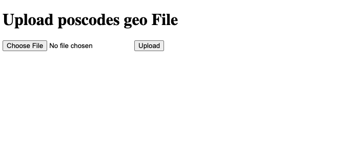
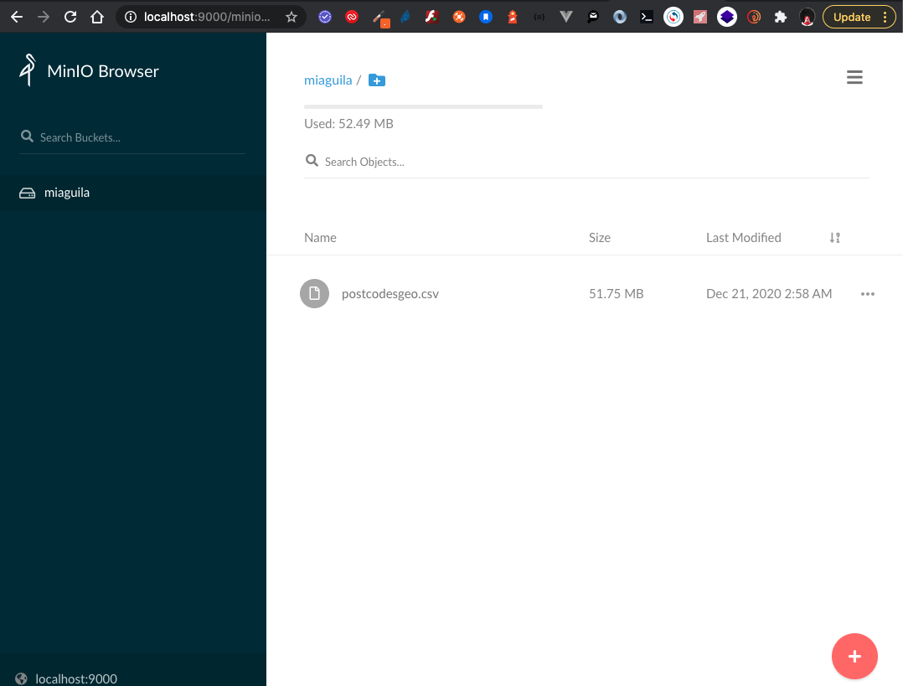
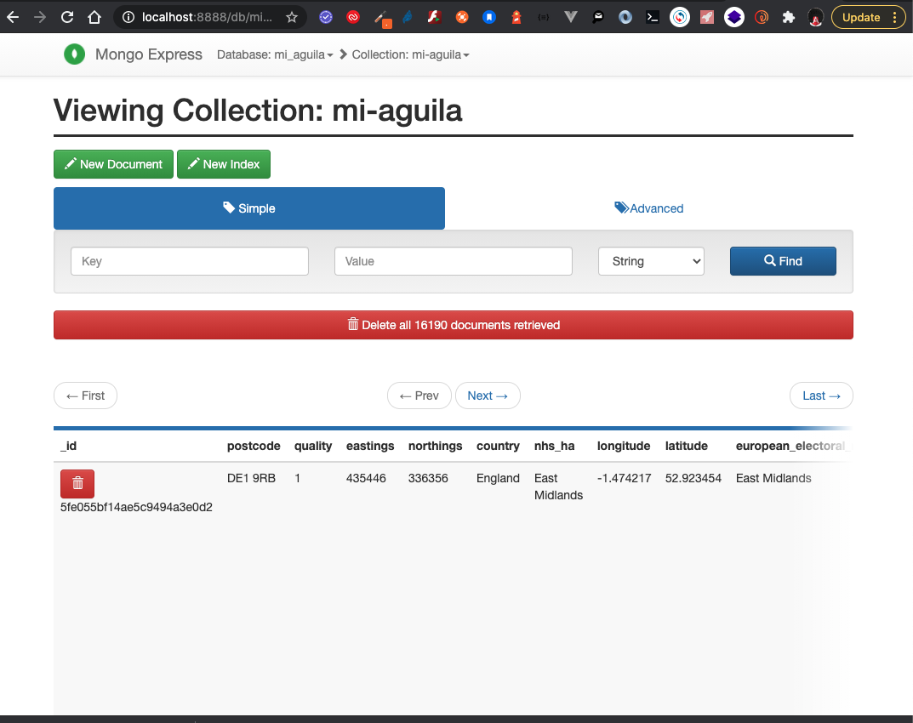

# poscodes geo

Sistema para la carga y procesamiento de archivos a gran escala.

# Arquitectura

# Requisitos

    - Docker
    - Docker-compose

# Tecnologias

    * Python
    * Flask
    * Python-RQ
    * Redis
    * Minio
    * MongoDB

# Run app

    $ docker-compose pull
    $ docker-compose up -d

##### Nota: si se genera algun error corriendo los contenedores, se pueden ejecutar los siguientes comando para limpiar y reiniciar docker ( Opcional )

    $ docker rm -f $(docker ps -a -q)
    $ sudo service docker restart

# Interfaces

#### 1. Primer microservicio

    http://localhost:5000/

#### 2. El archivo se sube a minio (similar a amazon s3)

    http://localhost:9000/

#### 3. Luego se envia al microservicio 2 ( ver diagrama en la parte superior)

en este punto se procesa el archivo, se consulta a la API y luego se inserta en una base datos mongoDB, se puede ir visualizando los datos que se van insertando en la siguiente url:

    http://localhost:8888/

### Se uso una metodologia de desarrollo basada en gitflow

# Ventajas

La escalabilidad es un factor muy importante, por esta razon el archivo no se almacena de forma local, se sube a un servicio de almacenamiento llamado minio; de esta forma se le envia la url de dicho archivo al siguiente microservicio para que lo procese, esto podria escalar a N candidad de nodos con kubernetes dependiendo el trafico que se reciba.

    BY: samuel bonilla 
    Email: pythonners@gmail.com

# License

MIT License

Copyright (c) Facebook, Inc. and its affiliates.

Permission is hereby granted, free of charge, to any person obtaining a copy
of this software and associated documentation files (the "Software"), to deal
in the Software without restriction, including without limitation the rights
to use, copy, modify, merge, publish, distribute, sublicense, and/or sell
copies of the Software, and to permit persons to whom the Software is
furnished to do so, subject to the following conditions:

The above copyright notice and this permission notice shall be included in all
copies or substantial portions of the Software.

THE SOFTWARE IS PROVIDED "AS IS", WITHOUT WARRANTY OF ANY KIND, EXPRESS OR
IMPLIED, INCLUDING BUT NOT LIMITED TO THE WARRANTIES OF MERCHANTABILITY,
FITNESS FOR A PARTICULAR PURPOSE AND NONINFRINGEMENT. IN NO EVENT SHALL THE
AUTHORS OR COPYRIGHT HOLDERS BE LIABLE FOR ANY CLAIM, DAMAGES OR OTHER
LIABILITY, WHETHER IN AN ACTION OF CONTRACT, TORT OR OTHERWISE, ARISING FROM,
OUT OF OR IN CONNECTION WITH THE SOFTWARE OR THE USE OR OTHER DEALINGS IN THE
SOFTWARE.