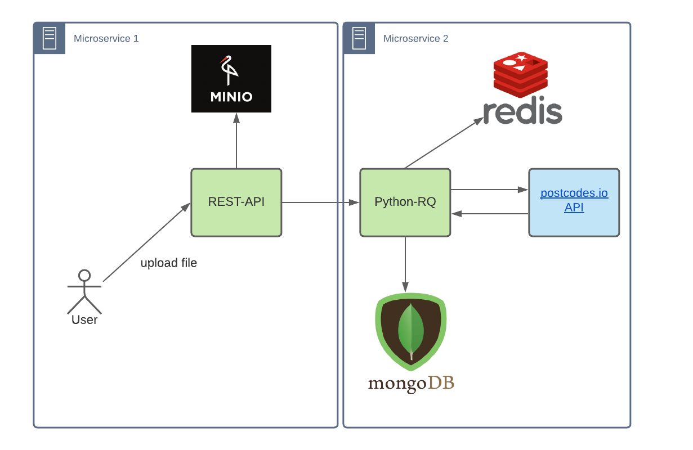

## poscodes geo

# Arquitectura

# Requisitos

    - Docker
    - Docker-compose

# Tecnologias

    * Python
    * Flask
    * Python-RQ
    * Redis
    * Minio
    * MongoDB

# Run app

    $ docker-compose pull
    $ docker-compose up -d

##### Nota: si se genera algun error corriendo el contenedor se puede ejecutar los siguientes comando para limpiar y reiniciar docker ( Opcional )

    $ docker rm -f $(docker ps -a -q)
    $ sudo service docker restart

